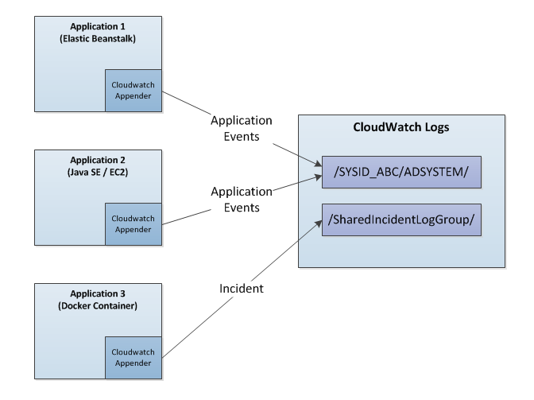
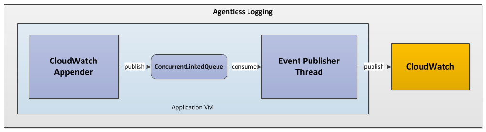
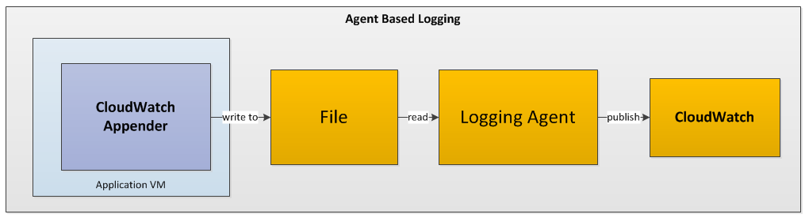

# DTCC Cloud Native Logger




The DTCC Cloud Native logger is a log4j2 extension that is suitable for any software running on the AWS platform. It supports the following features:

1) Everything that log4j2 can do, plus:
2) Configuration free for most use cases.
3) Fully Asynchronous, high throughput agentless logging.
4) Automatically organize and group events by application.
5) Includes custom layouts for both humans and Splunk.
6) Easily create incidents.
7) Route AWS SDK debug and tracing events to the logger
8) Better Resiliency (coming soon).

# What's new in version 1.0.2?

New cloudwatch appender is fully asynchronous and efficiently ships your logging events in batches. It can stream tens of thousands of log events per second even when running on premise on a developer VPOD. 

# How to install and use the logger

## Maven
The logger is available in Maven (N drive) as well as Nexus. To include the logger in your project, add this to your POM file:

```xml
<dependency>
	<groupId>com.dtcc.ecd</groupId>
	<artifactId>aws-log-utils</artifactId>
	<version>1.0.2</version>       
</dependency>
```

if you are building a JavaEE application, running inside a Servlet Container you should also include this dependency:

```xml
<dependency>
	<groupId>org.apache.logging.log4j</groupId>
	<artifactId>log4j-web</artifactId>
	<version>2.8</version>       
</dependency>
```

Please see the section on Servlet Container logging for additional details.

## Initializing the logger
Initializing the logger is done using a static initializer, and this should run only once as the beginning on your application, though subsequence calls to the initialize will have no effect.

The initializer is part of the ```com.dtcc.ecd.awslogutils.LoggerFactory``` and looks like this:

```java
public static void configureLog4j(String sysID, 
                                  String appName, 
                                  CloudWatchConnector cwClientInterface,
                                  boolean enableRequestLogging, 
                                  boolean enableWireLogging)
```

| Parameter            | Type                | Description                                     |
| ---------------------|---------------------|-------------------------------------------------|
| sysID                | String              | SYS ID of the application                       |
| appName              | String              | Application Name                                |
| cwClientInterface    | CloudWatchConnector | Cloudwatch Client Connector object              |
| enableRequestLogging | boolean             | Stream AWS SDK debug information to console     |
| enableWireLogging    | boolean             | Stream HTTP wire tracing information to console |


There are a few choices to make when initializing the logger, the biggest one being whether your software needs to use a proxy to interact with AWS services or not. As a rule of thumb, I will say that the answer is usually yes, unless you are building an Elastic Beanstalk application. Ultimately it all depends on which subnets your EC2 instances run in, but the rule is to put them into private subnets unless that becomes unfeasible.

### Initializing the logger when a web proxy is required.

The following code snipped shows you the easiest way to initialize the logger when using a proxy. Note that the proxy referenced here is suitable for the **development** environment in the **us-east-1** region.

This initialization method is best suited for Java SE applications running on EC2 and applications running in a Docker container.

```java
ClientConfiguration clientConfig = new ClientConfiguration();
clientConfig.setProxyHost("proxy-dev-us-east-1.dtcc.com");
clientConfig.setProxyPort(8080);

CloudWatchConnector connector = CloudWatchClientUtils.getDefaultEC2Connector(clientConfig);

LoggerFactory.configureLog4j("your-sysid", "your-application-name", connector, false, false);
```

Alternatively, you can also initialize the logger while using the AWS Authentication utilities. The advantage of this approach is that your code will work locally as well as in AWS. This technique works especially well for Beanstalk applications. If you like this technique, please refer to the AWSAuth utils documentation, also developed by ECD

```java
AWSAuthUtils awsAuthUtils = new AWSAuthUtils(new AWSAuthSimpleLogger(true));		   	   
DefaultConnector cwConnector = null;
		
try{   
	
	if (awsAuthUtils.isUseProxy()){	            	             
		cwConnector = new DefaultConnector(awsAuthUtils.getCredentials(), awsAuthUtils.getClientConfiguration());	             
	} 
	else{
		cwConnector = new DefaultConnector(awsAuthUtils.getCredentials(), null);
	}

	LoggerFactory.configureLog4j("your-sysid", "your-application-name", cwConnector, false, false);          
}
catch(LogException le){
	le.printStackTrace();
}
```

## Using the logger
Once you initialize the logger you can use the ```LoggerFactory``` to create actual instances of ```org.apache.logging.log4j.Logger``` logger like this:

```java
Logger humanReadableLogger = LoggerFactory.getEC2Logger(BuiltinLoggers.SIMPLE_LOGGER);
humanReadableLogger.debug("Debug Event");
humanReadableLogger.info("Informational Event");

Logger splunkBoundLogger = LoggerFactory.getEC2Logger(BuiltinLoggers.SPLUNK_LOGGER);
splunkBoundLogger.warn("Warining Event");
splunkBoundLogger.error("Error Event");

Logger asyncLogger = LoggerFactory.getEC2Logger(BuiltinLoggers.CONSOLE_LOGGER);
asyncLogger.info("This event will be logged to the console");

Logger incidentLogger = LoggerFactory.getIncidentLogger();      
incidentLogger.info("This is a incident. Page someone!!!");
```

The logging jar files include a preconfigured log4j configuration, which works out of the box. You can also supply your own configuration if you plan to tune things. These are the loggers that are supplied to you if you use the builtin configuration

1) **SIMPLE_LOGGER**: Uses a simple, more human readable format, and is best used when analyzing logs directly from CloudWatch.
	``` 
	[INFO] Publisher-00001 -- really important log event - Event: 9989 _INSTANCE_IDENTIFIER_=WAV3066 _APPLICATION_NAME_=LoggingSimulator _JMV_ID_=a627c3c07b46424397cea31b2cb7dc84 publisherName=Publisher-00013 _VM_UUID_=a627c3c07b46424397cea31b2cb7dc84 _SYSID_=ECD bankName=BONY userName='Michael E.' transactionID=TID_123
	```
2) **SPLUNK_LOGGER**: Uses a special layout suitable for splunk ingestion. Use this if you plan to stream your logs to splunk.
	```
	1502048203200 log_message='Publisher-00017 -- really important log event - Event: 9984' severity='INFO' _INSTANCE_IDENTIFIER_=WAV3066 _APPLICATION_NAME_=LoggingSimulator _JMV_ID_=a627c3c07b46424397cea31b2cb7dc84 publisherName=Publisher-00017 _VM_UUID_=a627c3c07b46424397cea31b2cb7dc84 _SYSID_=ECD bankName=CHASE userName='William B.' transactionID=TID_ABC
	```
3) **CONSOLE_LOGGER**: Logs directly to console using the same human readable format used by the **SIMPLE_LOGGER**

4) **Incident Logger**: Use this to log incidents. It behaves just like any other logger, except it will figure how to generate an incident on your behalf, and there is no special configuration needed to log an incident.

These loggers are defined in the following constants:

```java
package com.dtcc.ecd.awslogutils;

public class BuiltinLoggers {
	
	public static final String SIMPLE_LOGGER = "DefaultCloudWatchLogger";
	public static final String SPLUNK_LOGGER = "SplunkCloudWatchLogger";
	public static final String INCIDENT_LOGGER = "IncidentCloudWatch";	
	public static final String CONSOLE_LOGGER = "ConsoleLogger";
}
```

### How to enable agent based logging
All loggers provided here, with the exception of the incident logger are agentless, and work right out of the box as long they are initialized correctly. If you prefer agent based logging, you may achieve that by following these steps:

1) Supply your own configuration and add your favorite file appender. I recommend making a copy of the default configuration and adding to it. This way all existing functionality (especially incident creation) will be preserved.

2) Add this JVM parameter to your application:
```
    -Dlog4j.configurationFile=path/to/log4j2.xml
```

3) configure the logging agent of your choice.


## Finding your logs
Unless you are writing to a file and relying on an agent to publish your log events to CloudWatch, your initialization code will determine the destination log group used to collect your events.

For example, if you initialize your logger like this:
```java
LoggerFactory.configureLog4j("your-sysid", "your-application-name", conn, false, false);
```

your log events will be stored here:

```
/DTCC/AD_SOFTWARE/YOUR-SYSID/YOUR-APPLICATION-NAME
```

## Configuration

```aws-log-utils.jar``` contains a preconfigured copy of ```log4j.xml```, which will be used by defauly unless you speicify your own configuration; This will provide you the logging capabilities described here. It is also possible to include your own configuration and override what's included here by setting the following JVM variable, as described in the log4j2 documentation.

```
-Dlog4j.configurationFile=path/to/log4j2.xml
```

This may be useful if you want to take a copy of the existing configuration and add new loggers while still retaining the builtin ones. It's also a necessary step if you want to enable agent based logging

## IAM Security
Your logger will require access to CloudWatch, even if just to support the creation of incidents. Make sure that your IAM permissions include this.

```javascript
{
	"Effect": "Allow",
	"Action": [
		"logs:CreateLogGroup",
		"logs:CreateLogStream",
		"logs:PutLogEvents"
	],
	"Resource": "arn:aws:logs:*:*:*"
}
```

## Useful Tips

### Fish Tagging
Log4j2 comes with a very useful feature called the **Thread Context** which provides Fish Tagging and Service Event Correlation capabilities.

[https://logging.apache.org/log4j/2.x/manual/thread-context.html](https://logging.apache.org/log4j/2.x/manual/thread-context.html)

In Short, the **Thread Context** allows you to add arbitrary values to a hash like structure which will be carried to each log event until you clear it. The Thread Context is partitioned by thread, so it's perfectly suited for servlets an multi threaded applications where different threads serve different purposes.

Here is an example for how to use it:

```java

ThreadContext.put("ServletName", "LoggingServlet");
ThreadContext.put("UserName", "Mark H.");

Logger logger = LoggerFactory.getEC2Logger(BuiltinLoggers.SIMPLE_CW_LOGGER);

logger.info("This message will contain all values in the Thread Context");
```
Will result in a log event like this
```
[INFO] This message will contain all values in the Thread Context ServletName=LoggingServlet UserName='Mark H.'
```

To clear the ThreadContext, you can use this method call:

```LoggingUtils.cleanLog4jTheadContext()```

The ThreadContext is a great way to enable correlation IDs for your microservices. Use it now, you will thank me later!

# Logger implementation
The Logger is made up of a set of special Appenders and Layouts and a static initializer used to configure the CloudWatch Appenders with a valid client.

The logger supports both agent based and agentless logging, and the latter is done using an asynchrous appender that offloads all logging to a thread that efficiently batches and ships log events to cloudwatch.


## Agentless logging



The **SIMPLE_LOGGER** and **SPLUNK_LOGGER** are agentless and will write synchronously to CloudWatch. Agentless logging has the following characteristics:

1) Logger.log return immediately and appender writes the event to synchronized queue. If necessary it will start a CloudWatch publishing thread.

2) The publishing thread will stay alive as long there is active logging taking place. It's behavior is to batch log events and ship them to cloudwatch either periodically or when the batch grows too large. If the thread detects that logging has stopped for a period of time it will simply die. This is done to ensure that that the JVM can cleanly exit, and that nothing is tying it up.


## Agent Based logging



Agent based logging simply means that you write to a log file, and rely on an external agent to push logging events to CloudWatch. As of version 1.0.2 the log4j configuration does not provide a file based logger, but you can override the default configuration and supply your own. We may provide to provide one in the future.

1) Logging is file based. You may still choose to log using a human readable layout or Splunk layout

2) You need to configure the CloudWatch agent yourself, and the logger makes no assumption as to which agent is used. Log Group organization and the grouping of log events becomes a function of agent configuration. Some agents give you more flexibility than others.

3) Incident Logging is still possible, but it will still write directly to CloudWatch

# Logging in Web Applications

This logger is perfectly suited for web development, and because fundamentally this is just an extension of log4j, it is useful to look at the Apache documentation, for special consideration when using the logger inside a Web Application

[https://logging.apache.org/log4j/2.0/manual/webapp.html](https://logging.apache.org/log4j/2.0/manual/webapp.html)

# Internal log4j configuration

This is a copy of the internal ```log4j.xml``` that supplied with the logger. You may modify this, tune it to your needs, and supply this externally to your application.

```xml
<?xml version="1.0" encoding="UTF-8"?>
<Configuration status="info" packages="com.dtcc.ecd.awslogutils.log4j_plugins">
  <Appenders>
    <Console name="Console" target="SYSTEM_OUT">
      <PatternLayout pattern="%d{HH:mm:ss.SSS} [%-5level] %logger{36} - %msg %XX%n"/>
    </Console>
    <CloudWatchAppender name="SimpleLayoutCloudWatchAppender" streamExtension="simple_fragment">
       <PatternLayout pattern="[%level] %msg %XX"/>
    </CloudWatchAppender>
    <CloudWatchAppender name="SplunkLayoutCloudWatchAppender" streamExtension="splunk_fragment">
       <PatternLayout pattern="%d{UNIX_MILLIS} log_message='%msg' severity='%level' %XX"/>
    </CloudWatchAppender>
    <CloudWatchIncidentAppender name="CloudWatchIncidentAppender" otherAttribute="">
        <PatternLayout pattern="%X{__LOG4J_THREADCONTEXT_SYSID__}!?!%m!?!%X{__LOG4J_THREADCONTEXT_INCIDENT_ORIGIN__}!?!%class!?!%method!?!%d{DEFAULT}"/>
    </CloudWatchIncidentAppender>
  </Appenders>
  <Loggers>
    <Logger name="SplunkCloudWatchLogger" level="info" additivity="false">
      <AppenderRef ref="SplunkLayoutCloudWatchAppender"/>
    </Logger>
    <AsyncLogger name="SplunkCloudWatchLoggerAsync" level="info" additivity="false">
      <AppenderRef ref="SplunkLayoutCloudWatchAppender"/>
    </AsyncLogger>
  	<Logger name="DefaultCloudWatchLogger" level="info" additivity="false">
      <AppenderRef ref="SimpleLayoutCloudWatchAppender"/>
    </Logger>
  	<AsyncLogger name="DefaultCloudWatchLoggerAsync" level="info" additivity="false">
      <AppenderRef ref="SimpleLayoutCloudWatchAppender"/>
    </AsyncLogger>
    <Logger name="IncidentCloudWatch" level="info" additivity="false">
      <AppenderRef ref="CloudWatchIncidentAppender"/>
    </Logger>
    <Logger name="ConsoleLogger" level="trace" additivity="false">
      <AppenderRef ref="Console"/>
    </Logger>
    <Logger name="com.amazonaws.request" level="off" additivity="false">
      <AppenderRef ref="Console"/>
    </Logger>
    <Logger name="org.apache.http.wire" level="off" additivity="false">
      <AppenderRef ref="Console"/>
    </Logger>
    <Root>
      <AppenderRef ref="Console"/>
    </Root>
  </Loggers>
</Configuration>
```
